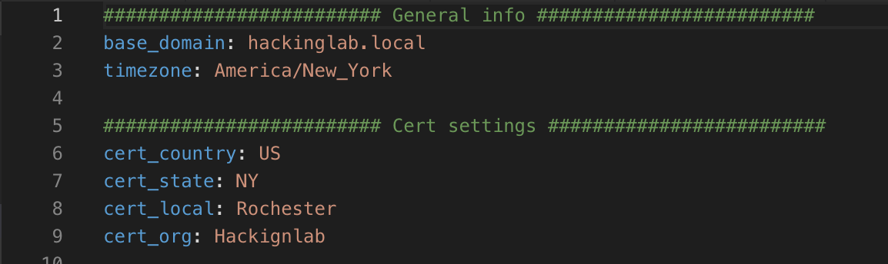

# SplunkBroRsyslog

## Setup General settings
1. `mv group_vars/all.example group_vars/all.yml`
1. `vim group_vars/all.yml` and set:
    1. `base_domain`
    1. Cert settings for OpenSSL cert
    1. 

## Setup Slack alerts - optional
1. `vim group_vars/all.yml` and set:
    1. `slack_channel`
    1. `slack_token`

## Supported OSes
* Ubuntu 18.04 64-bit