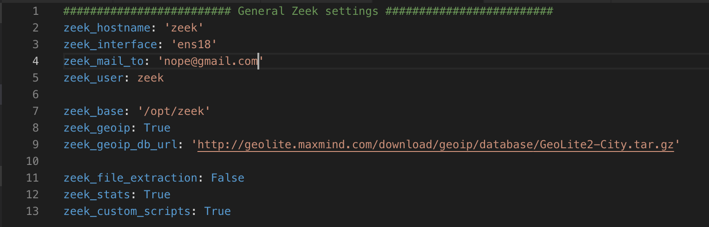

# Zeek
[Zeek](https://www.bro.org/documentation/index.html) is a powerful system that on top of the functionality it provides out of the box, also offers the flexibility to customize analysis pretty much arbitrarily. We provide a range of documentation material ranging from introductory material to get you started, to full references of Bro’s various frameworks.

## Install/Setup 
1. `vim hosts.ini` and set:
    1. `ansible_host` - Set to an IP address you want to setup Zeek on
1. `mv group_vars/zeek.example group_vars/zeek.yml`
1. `vim group_vars/group_vars.yml` and set:
    1. `zeek_hostname` - Set hostname of this box
    1. `zeek_interface` - Interface for Zeek to listen on
    1. `zeek_mail_to` - Address to send Zeek alerts
    1. `zeek_file_extraction` - Enable the file extraction script - Will take up significant disk space
        1. By default set to `False`
    1. `zeek_stats` - Enable Zeek stats script
    1. `zeek_custom_scripts` - Enable custom Zeek scripts (See below for more details)
    1. 
1. `ansible-playbook -i hosts.ini deploy_zeek.yml -u <user> -K`

## Custom scripts

The ansible playbook is setup to add custom scripts to the Zeek setup. Custom Zeek scripts must be added to `conf/zeek/scripts/<zeek_script>.bro`.

#### smb_psexec.bro

This custom script comes with this playbook by default. This script detects PSexec utilizing the `$IPC` and `$admin` share on Windows.

## Resources/Sources
* [ReadTheDocs - Zeek - Install](https://docs.zeek.org/en/stable/install/install.html)
* [ReadTheDocs - Zeek - GeoIP](https://docs.zeek.org/en/stable/frameworks/geoip.html)
* [MaxMind GeoIP database download](http://geolite.maxmind.com/download/geoip/database/GeoLite2-City.tar.gz)
* [Installing Bro IDS on Fedora 25](https://www.vultr.com/docs/installing-bro-ids-on-fedora-25)
* [BroControl](https://www.bro.org/sphinx/components/broctl/README.html)
* [How To Install EPEL Repo on a CentOS and RHEL 7.x](https://www.cyberciti.biz/faq/installing-rhel-epel-repo-on-centos-redhat-7-x/)
* [Writing Bro Plugins](https://www.bro.org/sphinx-git/devel/plugins.html)
* [extract-all-files.bro](https://www.bro.org/sphinx/scripts/policy/frameworks/files/extract-all-files.bro.html)
* [stats.bro](https://www.bro.org/sphinx/scripts/policy/misc/stats.bro.html)
* [Bro Package Manager: list of packages](http://blog.bro.org/2017/06/bro-package-manager-list-of-packages.html)
* [Detecting Malicious SMB Activity Using Bro](https://www.sans.org/reading-room/whitepapers/detection/detecting-malicious-smb-activity-bro-37472)
* [MIME Types List](https://www.freeformatter.com/mime-types-list.html)
* [THREAT HUNTING WITH BRO](https://sqrrl.com/threat-hunting-bro/)
* [Binary Packages for Bro Releases](https://www.bro.org/download/packages.html) 